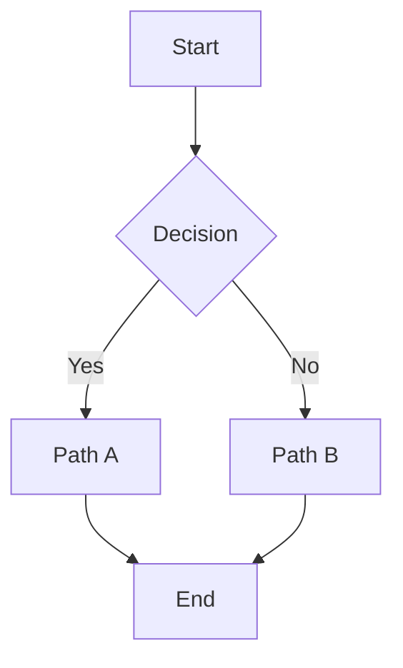

---
cssclasses:
  - native
  - module
  - memorium
  - memorium-daily
  - Thursday
tags:
  - benchmark
memorium-date: 2026-07-30
memorium-day-rating: 3
memorium-daily-summary: Today I worked on the benchmark system for the vault. Created 12 comprehensive benchmark notes covering all CSS classes, MetaBind components, DataviewJS renderings, and interactive elements. The benchmarks will help catch styling regressions when modifying CSS snippets or templates.
journal: daily
journal-date: 2026-07-30
aliases: Benchmark Day
---

# 2026-07-30-Thursday

---

## Alias

```meta-bind
INPUT[text(placeholder('Name your Day!'), class('input-alias')):aliases]
```

---

## Rating

```meta-bind
INPUT[progressBar(minValue(1), maxValue(10), addLabels(true), class(rating-bar)):memorium-day-rating]
```

---

## Navigation

```meta-bind-button
id: prev-day
class: nav-buttons
style: primary
label: <- Yesterday
hidden: true
actions:
  - type: open
    link: "[[benchmark-navigation-dummy]]"
    newTab: false
```

```meta-bind-button
id: current-week
class: nav-buttons
style: primary
label: This Week
hidden: true
actions:
  - type: open
    link: "[[benchmark-navigation-dummy]]"
    newTab: false
```

```meta-bind-button
id: current-month
class: nav-buttons
style: primary
label: This Month
hidden: true
actions:
  - type: open
    link: "[[benchmark-navigation-dummy]]"
    newTab: false
```

```meta-bind-button
id: next-day
class: nav-buttons
style: primary
label: Tomorrow ->
hidden: true
actions:
  - type: open
    link: "[[benchmark-navigation-dummy]]"
    newTab: false
```

`BUTTON[prev-day, current-week, current-month, next-day]`

---

## Summary

```meta-bind
INPUT[editor(class(text-editor-content)):memorium-daily-summary]
```

---

## Throwback (On This Day)

This section would normally show daily notes from the same calendar day in previous years.

```dataviewjs
const currentDay = "07-30";
const allDailies = dv.pages('"02 - Ψ - Memorium/01 - Daily"')
  .where(p => p.file.name.includes(currentDay) && p.file.name !== "2026-07-30-Thursday");

if (allDailies.length === 0) {
  dv.paragraph("*No previous entries for this day.*");
} else {
  dv.list(allDailies.file.link);
}
```

---

## Markdown Content

---

## Headers

# H1 – Title

## H2 – Section

### H3 – Subsection

#### H4 – Minor Heading

##### H5 – Very Small

###### H6 – Minimal

---

## Text Formatting

Plain paragraph text.

**Bold text**  
*Italic text*  
***Bold + Italic***  
~~Strikethrough~~  
==Highlighted text==  
`inline code`

Subscript: H~2~O  
Superscript: x^2^

---

## Lists

### Unordered

- First level item A
- First level item B
  - Second level item B1
  - Second level item B2
    - Third level item

### Ordered

1. First step
2. Second step
3. Third step

---

## Links

- External: [Obsidian Website](https://obsidian.md/)
- Internal: [[Some Note]]
- Internal with alias: [[Some Note|Display Alias]]

---

## Blockquotes

> Simple blockquote.

> Multi-line blockquote  
> that wraps to another line.
>
> > Nested blockquote.
> > > Deeply nested.

---

## Callouts

> [!note]
> Standard **note** callout.

> [!info]
> Informational callout.

> [!tip]
> Tip callout with helpful advice.

> [!warning]
> Warning callout for caution.

> [!danger]
> Danger callout for critical items.

> [!example]
> Example callout for demonstrations.

> [!quote]
> Quote callout for citations.

### Foldable Callout

> [!note]- Click to expand
> This content is hidden until the callout is expanded.

---

## Code Blocks

```python
def fibonacci(n: int) -> list[int]:
    seq = [0, 1]
    for _ in range(n - 2):
        seq.append(seq[-1] + seq[-2])
    return seq[:n]
```

```javascript
const greet = (name) => `Hello, ${name}!`;
console.log(greet("Obsidian"));
```

```css
.benchmark {
  display: flex;
  gap: 1rem;
  padding: 2rem;
}
```

---

## Tables

| Left Align | Center Align | Right Align |
|:-----------|:------------:|------------:|
| Cell A1    | Cell B1      | Cell C1     |
| Cell A2    | **Bold**     | *Italic*    |
| A3         | `code`       | 42          |

---

## Tasks

- [ ] Unchecked task item
- [x] Completed task item

---

## LaTeX Math

Inline: $E = mc^2$

Block:

$$
\int_{0}^{\infty} e^{-x} \, dx = 1
$$

---

## Mermaid Diagrams



---

## Tags

#benchmark #memorium #daily

---

## Separators

---

---

## Frontmatter (YAML)

```yaml
cssclasses: [native, module, memorium, memorium-daily, Thursday]
memorium-day-rating: "7"
memorium-daily-summary: "..."
journal: daily
journal-date: 2026-07-30
aliases: [Benchmark Day]
context: ["[[2026-W31]]", "[[2026-07-July]]"]
```

---

## Verification Checklist

- [ ] `memorium-daily` class applies Memorium Daily-specific styling
- [ ] `Thursday` class applies Thursday color palette (Memorium daily has per-day colors)
- [ ] Day rating slider (1–10) renders with color-coded `rating-bar` (+ ☆ prefix)
- [ ] Alias input shows "Name your Day!" placeholder
- [ ] Summary editor renders a rich text area
- [ ] Navigation buttons render: `<- Yesterday`, `This Week`, `This Month`, `Tomorrow ->`
- [ ] Navigation buttons have the `nav-buttons` class for custom styling
- [ ] Throwback section queries daily notes from the same calendar day
- [ ] All NATIVE frontmatter properties are present (`version`, `key`, `creation`, `context`, `related`, `cssclasses`, `tags`, `aliases`)
- [ ] Memorium-specific properties are present (`memorium-date`, `memorium-day-rating`, `memorium-daily-summary`, `journal`, `journal-date`)
- [ ] Module theming (Memorium) + daily theming + Thursday palette all apply correctly

> **This is the closest benchmark to a real daily note.** The only difference is that a real daily note's navigation buttons use `tp.file.title` / `moment()` to generate actual dates, while here they link to a dummy note.
