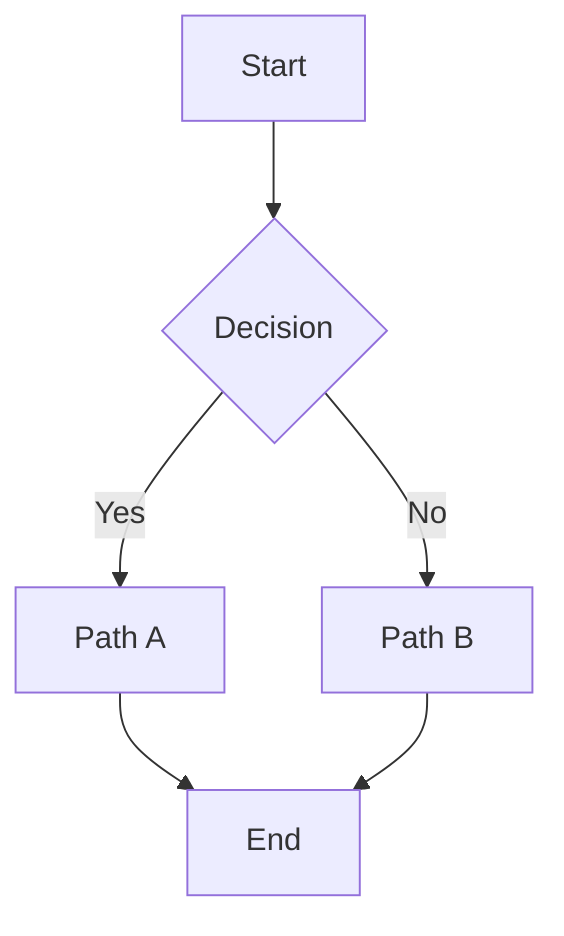
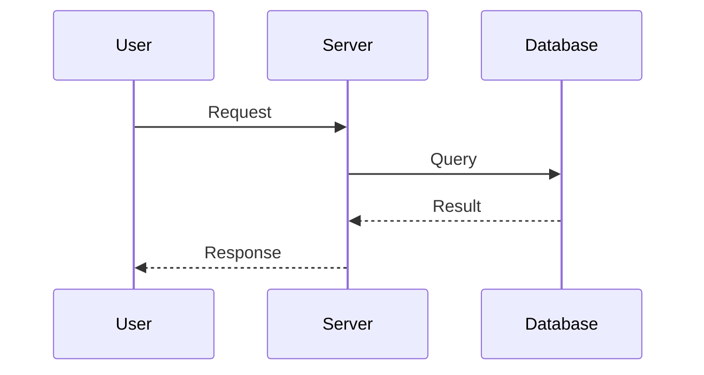

---
cssclasses:
  - native
  - module
  - memorium
  - hide-all-frontmatter
  - hide-inline-title
  - center-header-title
  - huge-header-title
  - italic-header-title
tags:
  - benchmark
---

# Utility Classes Benchmark

> **Purpose:** Tests ALL utility CSS classes active simultaneously: `hide-all-frontmatter`, `hide-inline-title`, `center-header-title`, `huge-header-title`, `italic-header-title`. The frontmatter block above should be invisible. The inline title should also be hidden (below is a manual H1 simulating the title).

---

## Active Utilities

| Class | Expected Behavior |
|---|---|
| `hide-all-frontmatter` | YAML frontmatter block is completely hidden |
| `hide-inline-title` | Obsidian's auto-generated inline title is hidden (this H1 is manual) |
| `center-header-title` | H1 headings are centered |
| `huge-header-title` | H1 headings are 74px |
| `italic-header-title` | Headers should render in italic |

> **Check:** If you can see the YAML frontmatter above this line, `hide-all-frontmatter` is NOT working.

---

## Headers

# H1 – Centered, Huge, Italic

## H2 – Section (should NOT be centered/huge/italic — only H1)

### H3 – Subsection

#### H4 – Minor Heading

##### H5 – Very Small

###### H6 – Minimal

---

## Text Formatting

Plain paragraph text for baseline comparison.

**Bold text**  
*Italic text*  
***Bold + Italic***  
~~Strikethrough~~  
==Highlighted text==  
`inline code`

Subscript: H~2~O  
Superscript: x^2^

---

## Lists

### Unordered

- First level item A
- First level item B
  - Second level item B1
  - Second level item B2
    - Third level item

### Ordered

1. First step
2. Second step
3. Third step

### Mixed

- Main point
  1. Ordered sub-step one
  2. Ordered sub-step two
- Another main point

---

## Links

- External: [Obsidian Website](https://obsidian.md/)
- Internal: [[Some Note]]
- Internal with alias: [[Some Note|Display Alias]]
- Bare wiki link: [[Another Note]]

---

## Images

External image:


Internal embed:

![[placeholder.png]]

---

## Blockquotes

> Simple blockquote.

> Multi-line blockquote  
> that wraps to another line.
>
> > Nested blockquote.
> > > Deeply nested.

---

## Code Blocks

### No language

```
function hello() {
  return "plain text, no highlighting";
}
```

### With language

```python
def fibonacci(n: int) -> list[int]:
    seq = [0, 1]
    for _ in range(n - 2):
        seq.append(seq[-1] + seq[-2])
    return seq[:n]
```

```javascript
const greet = (name) => `Hello, ${name}!`;
console.log(greet("Obsidian"));
```

```css
.benchmark {
  display: flex;
  gap: 1rem;
  padding: 2rem;
}
```

```bash
for f in *.md; do
  echo "Processing $f"
done
```

---

## Tables

| Left Align | Center Align | Right Align |
|:-----------|:------------:|------------:|
| Cell A1    | Cell B1      | Cell C1     |
| Cell A2    | **Bold**     | *Italic*    |
| A3         | `code`       | 42          |

---

## Tasks

- [ ] Unchecked task item
- [x] Completed task item
- [ ] ~~Cancelled task~~ (strikethrough in task)

---

## Callouts

> [!note]
> Standard **note** callout.

> [!info]
> Informational callout.

> [!tip]
> Tip callout with helpful advice.

> [!warning]
> Warning callout for caution.

> [!danger]
> Danger callout for critical items.

> [!example]
> Example callout for demonstrations.

> [!quote]
> Quote callout for citations.

### Foldable Callout

> [!note]- Click to expand
> This content is hidden until the callout is expanded.

---

## LaTeX Math

Inline: $E = mc^2$

Block:

$$
\int_{0}^{\infty} e^{-x} \, dx = 1
$$

Aligned equations:

$$
\begin{aligned}
\nabla \times \mathbf{E} &= -\frac{\partial \mathbf{B}}{\partial t} \\
\nabla \times \mathbf{B} &= \mu_0 \mathbf{J} + \mu_0 \epsilon_0 \frac{\partial \mathbf{E}}{\partial t}
\end{aligned}
$$

---

## Mermaid Diagrams





---

## Tags

#benchmark

---

## Separators

Text above separator.

---

Text between separators.

---

Text below separator.

---

## Verification Checklist

- [ ] Frontmatter (YAML block) is invisible — `hide-all-frontmatter` works
- [ ] No auto-generated inline title — `hide-inline-title` works
- [ ] H1 is centered — `center-header-title` works
- [ ] H1 is 74px — `huge-header-title` works
- [ ] H1 is italic — `italic-header-title` works
- [ ] H2–H6 are NOT affected by center/huge/italic (only H1 is targeted)
- [ ] Module colors (Memorium) still apply normally
