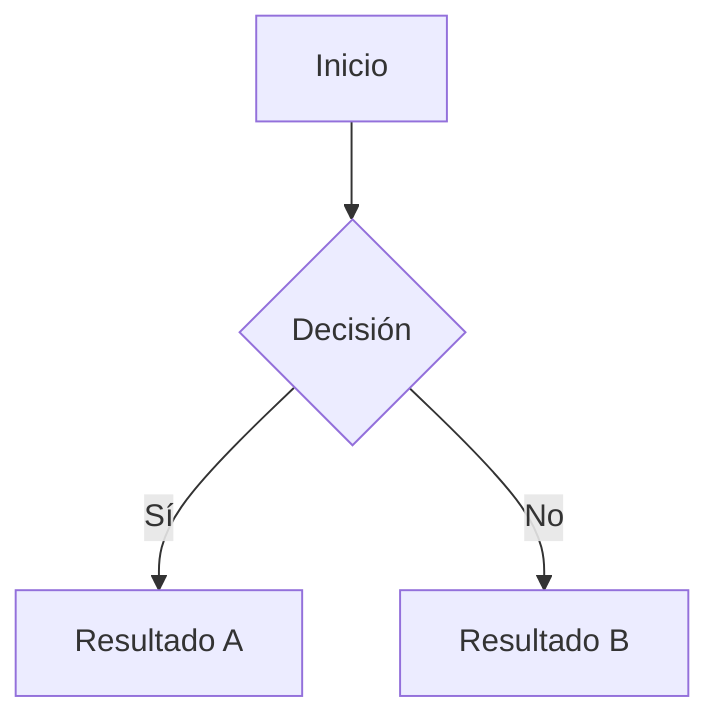

---
cssclasses:
  - native
  - main
  - module
  - inthima
tags:
  - MEMORIUM
  - daily
---
# Obsidian Native Markdown Benchmark
---

## Tabla de contenidos

- [[#Encabezados]]
- [[#Texto y formato]]
- [[#Listas]]
- [[#Enlaces]]
- [[#Imágenes]]
- [[#Citas]]
- [[#Código]]
- [[#Tablas]]
- [[#Tareas]]
- [[#Callouts]]
- [[#Bloques especiales de Obsidian]]
- [[#Separadores]]
- [[#Markdown extendido]]

---

## Encabezados

# H1 – Título principal

## H2 – Sección

### H3 – Subsección

#### H4 – Encabezado menor

##### H5 – Muy pequeño

###### H6 – Mínimo

---

## Texto y formato

Texto normal.

**Negrita**
_Cursiva_
_**Negrita + cursiva**_
~~Tachado~~  
==Resaltado== (si el tema lo soporta)

Subíndice: H~2~O  
Superíndice: x^2^

Texto con `código en línea`.

---

## Listas

### Lista no ordenada

- Elemento A
    
- Elemento B
    
    - Sub-elemento B1
        
    - Sub-elemento B2
        
        - Sub-sub-elemento
            

### Lista ordenada

1. Primer elemento
    
2. Segundo elemento
    
3. Tercer elemento
    

### Lista mixta

- Punto principal
    
    1. Paso uno
        
    2. Paso dos
        

---

## Enlaces

- Enlace externo: [Obsidian](https://obsidian.md/)
    
- Enlace interno: [[Nota de ejemplo]]
    
- Enlace con alias: [[Nota de ejemplo|Alias visible]]
    

---

## Imágenes

Imagen externa:


Imagen local (si existe en el vault):

![[imagen-local.png]]

---

## Citas

> Esto es una cita simple.

> Cita multilínea  
> que continúa aquí.
> 
> > Cita anidada.

---

## Código

### Bloque de código sin lenguaje

```
Texto plano
sin resaltado
```

### Bloque de código con lenguaje

```python
def hola():
    print("Hola, Obsidian")
```

```js
const theme = "dark";
console.log(theme);
```

---

## Tablas

| Columna A | Columna B | Columna C |
| --------: | :-------: | :-------- |
|   Derecha |  Centro   | Izquierda |
|       123 |    456    | 789       |
|     Texto | **Bold**  | _Italic_  |

---

## Tareas

-  Tarea pendiente
    
-  Tarea completada
    
- [x] Tarea en progreso (tema-dependiente)
    
- [x] Tarea importante
    
- [x] Tarea dudosa
    

---

## Callouts

> [!note]  
> Esto es un **callout NOTE**.

> [!info]  
> Callout de información.

> [!tip]  
> Callout de consejo.

> [!warning]  
> Callout de advertencia.

> [!danger]  
> Callout de peligro.

> [!example]  
> Callout de ejemplo.

---

## Bloques especiales de Obsidian

### Bloque de cita plegable

> [!note]- Nota plegable  
> Este contenido puede colapsarse.

### Comentarios (no visibles en preview)

%% Esto es un comentario %%

### Frontmatter (ejemplo)

---

## title: Obsidian Theme Test  
tags: [theme, markdown, test]  
created: 2025-01-01

---

## Separadores

---

---

---

---

## Markdown extendido

### Matemáticas (LaTeX)

Inline: $E = mc^2$

Bloque:

$$  
\int_0^\infty e^{-x} dx = 1  
$$

---

### Diagramas (Mermaid)



---

## 🧩 Fin del placeholder

Si tu tema se ve bien aquí, **probablemente esté bien en todo el vault** 😄